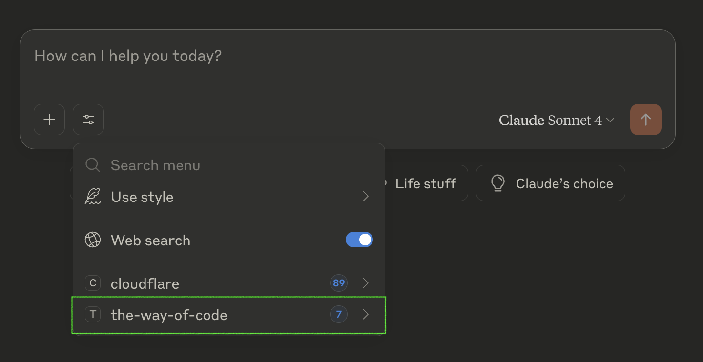

# The Way of Code
## The Timeless Art of Vibe Coding

*Based on the Tao Te Ching by Lao Tzu, adapted by Rick Rubin for the age of AI-driven development*

[](https://gitmcp.io/mgd1984/the-way-of-code)

> "The code that can be named is not the eternal code. The function that can be defined is not the limitless function."

## 🌊 Vision

The Way of Code is a foundational resource designed to infuse the principles of vibe-coding into every AI development session. Whether you're using Cursor, Windsurf, Claude, or any other AI coding assistant, these timeless principles should guide the creation of elegant, harmonious code.

## 🚀 Quick Integration

### For GitMCP.io Users (Instant Setup)
Transform any GitHub repository into an AI-accessible documentation hub:
```
https://gitmcp.io/mgd1984/the-way-of-code
```
Simply add this URL as an MCP server in your AI assistant for instant access to The Way of Code principles.

### For MCP Server (NPM Package)
Install and use our dedicated MCP server:
```bash
# NPX (recommended)
npx the-way-of-code

# Global installation
npm install -g the-way-of-code
```

Add to your AI assistant configuration:
```json
{
  "mcpServers": {
    "the-way-of-code": {
      "command": "npx",
      "args": ["the-way-of-code"]
    }
  }
}
```

### For Cursor Users
Add this to your `.cursor/mcp.json`:
```json
{
  "mcpServers": {
    "the-way-of-code": {
      "command": "npx",
      "args": ["the-way-of-code"]
    },
    "gitmcp-way-of-code": {
      "url": "https://gitmcp.io/mgd1984/the-way-of-code"
    }
  }
}
```

### For Claude Desktop
Add to your configuration:
```json
{
  "mcpServers": {
    "the-way-of-code": {
      "command": "npx",
      "args": ["the-way-of-code"]
    }
  }
}
```

### For MCP-Compatible Tools
Connect to our MCP server for real-time access to The Way of Code:
```bash
npm install -g @the-way-of-code/mcp-server
```

### For Any AI Assistant
Simply reference this repository in your prompts:
```
Please code following The Way of Code principles from: https://github.com/[username]/the-way-of-code
```

## 🚀 MCP Server

The Way of Code is available as a **complete Model Context Protocol (MCP) server** with full capabilities:

### 📦 Quick Start
```bash
# Install and run
npx the-way-of-code

# Or install globally
npm install -g the-way-of-code
```

### 🎯 Complete MCP Implementation

Our server implements all three MCP primitives for maximum flexibility:

#### 🛠️ **Tools** (Model-Controlled)
- `get_chapter` - Retrieve specific chapters (1-81)
- `search_principles` - Find relevant wisdom for coding situations
- `get_daily_wisdom` - Get today's wisdom based on current date
- `get_principles_by_topic` - Access principles by topic (simplicity, flow, etc.)
- `get_core_principles` - The five fundamental principles
- `find_wisdom_by_keyword` - Search chapters by keywords
- `get_philosophical_context` - Deep philosophical background

#### 📚 **Resources** (Application-Controlled)
- `way://chapters/all` - Complete chapter collection (JSON)
- `way://principles/core` - Core principles (JSON)
- `way://wisdom/daily` - Daily wisdom (Markdown)
- `way://philosophy/overview` - Complete philosophical framework (Markdown)
- `way://keywords/index` - Searchable keyword index (JSON)

#### 💡 **Prompts** (User-Controlled)
- `code-review-wisdom` - Philosophical code review guidance
- `debug-with-presence` - Mindful debugging approach
- `architecture-balance` - Balanced system design
- `refactor-with-flow` - Natural code refactoring
- `team-collaboration` - Harmonious team dynamics
- `daily-reflection` - End-of-day practice reflection

### 🔧 Configuration Examples

#### Claude Desktop
```json
{
  "mcpServers": {
    "the-way-of-code": {
      "command": "npx",
      "args": ["the-way-of-code"]
    }
  }
}
```
<p align="center">
  <br/>
  
</p>

#### Cursor IDE
```json
{
  "mcpServers": {
    "the-way-of-code": {
      "command": "npx",
      "args": ["the-way-of-code"]
    }
  }
}
```
<p align="center">
  
```

#### GitMCP.io Integration
For instant access without local installation:
```
https://gitmcp.io/mgd1984/the-way-of-code
```

### 🌊 Usage Philosophy

The server embodies The Way of Code principles:
- **Resources** provide context like still water reflecting wisdom
- **Tools** act when called upon, like water flowing around obstacles  
- **Prompts** guide users naturally toward mindful solutions

Each capability serves a different aspect of the development journey, from quick lookups to deep philosophical guidance.

## 📖 The Chapters

The complete 81 chapters of The Way of Code are organized for easy reference and integration:

- **[Core Principles](./principles/core-principles.md)** - Essential concepts for daily coding
- **[Complete Text](./text/complete.md)** - All 81 chapters
- **[Chapter Index](./text/index.md)** - Quick reference by topic
- **[Daily Wisdom](./daily/)** - Chapter-a-day format

## 🛠 Integration Methods

### 1. **Direct Reference**
- Link to specific chapters in your AI prompts
- Include principles in your project documentation
- Reference in code comments for context

### 2. **MCP Server** (Recommended)
- Real-time access to relevant chapters
- Context-aware principle suggestions
- Integration with Cursor, Claude, and other MCP-compatible tools

### 3. **Cursor Rules**
- Pre-configured `.cursorrules` files
- Project-specific principle sets
- Automatic principle injection

### 4. **API Access**
- RESTful API for programmatic access
- Webhook integrations
- Custom tool development

## 🎯 Use Cases

- **AI IDE Integration**: Embed principles directly into your coding environment
- **Code Reviews**: Reference relevant chapters for guidance
- **Team Standards**: Establish vibe-coding practices across your organization
- **Training Data**: Influence AI model behavior through principle-guided code
- **Documentation**: Include philosophical context in technical docs

## 🌟 Contributing

The Way of Code grows through community wisdom. Contribute by:
- Adding integration examples
- Creating language-specific adaptations
- Sharing vibe-coding experiences
- Improving accessibility and reach

## 📚 Resources

- **[Original Gist](https://gist.github.com/mysticaltech/8b91a40141001a6e725f568c22cc5e1b)** - Rick Rubin's original adaptation
- **[Integration Examples](./examples/)** - Real-world usage patterns
- **[Community Discussions](./discussions/)** - Share your vibe-coding journey

---

*"The Vibe Coder does not accumulate possessions. The more they do for others, the more they gain. The more they give away, the more they have."* - Chapter 81 